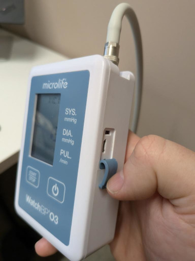
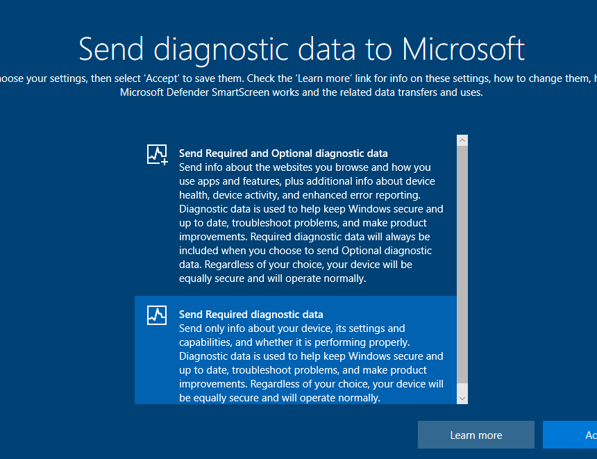
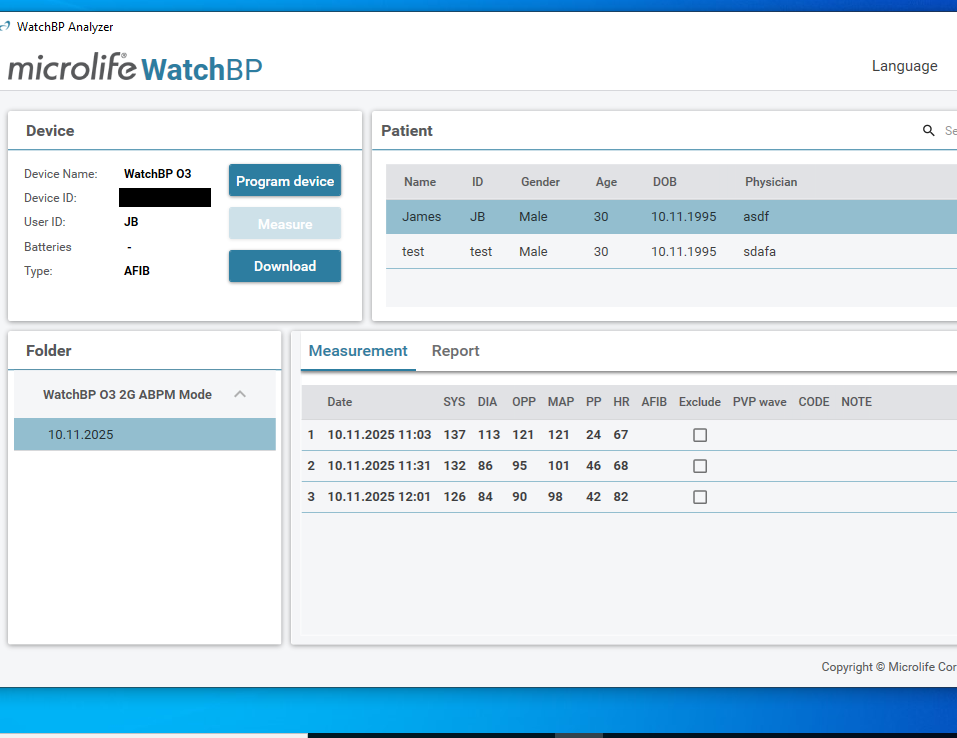
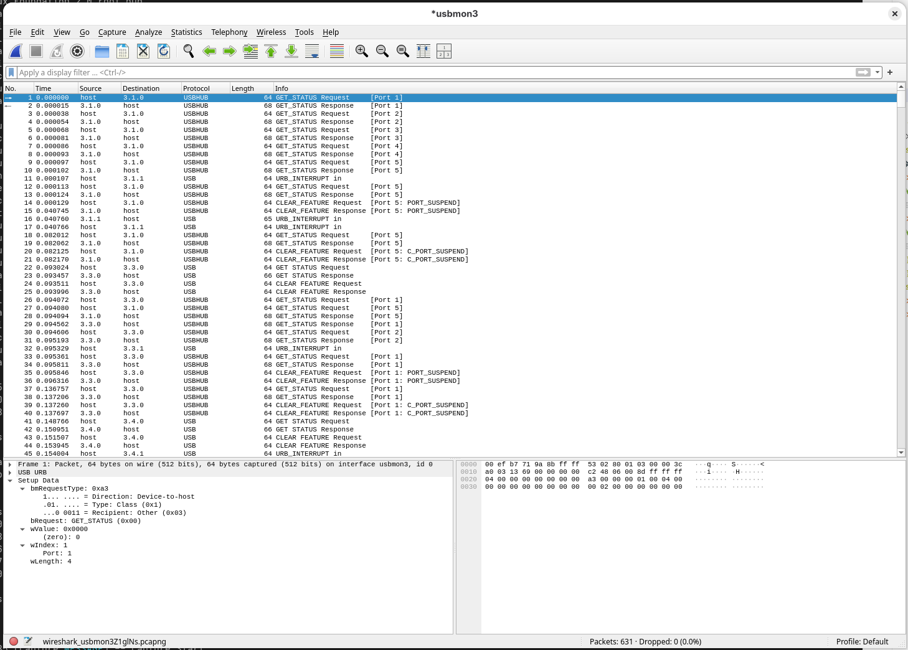
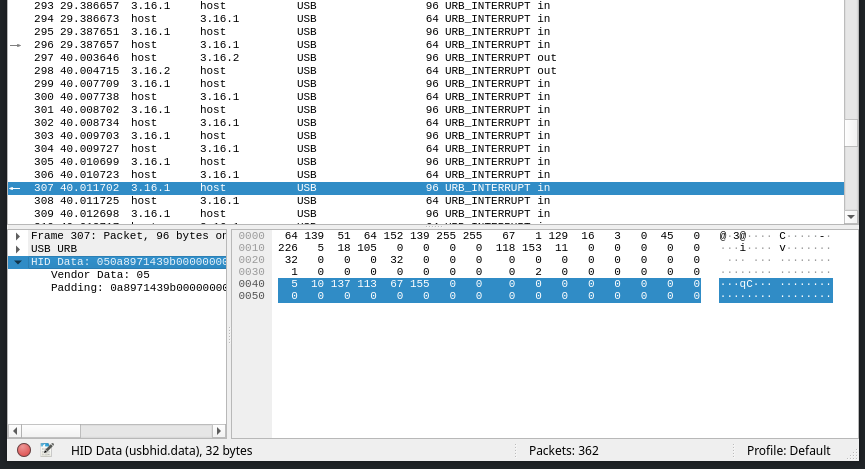
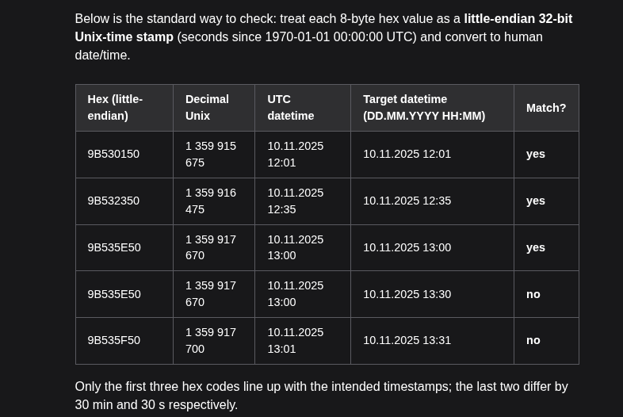

Yesterday after receiving my yearly flu vaccine at the pharmacy I was offered a blood pressure test, which reported a reading that made the young pharmacist who had just given me my vaccine a bit worried.

Off the back of this she offered me a 24 hour study, and then strapped a cuff to my arm plumbed into a little device which I had to wear in a little caddy - the cuff would inflate every 30 minutes during the day and every 60 minutes during the night, and then tomorrow I would bring it back for analysis.

"Can I read the measurements?" I asked, as it was being strapped to me.

"Oh, no, that will just stress you out. We turn that off". Fair enough.

Thing is, this device had a little micro-USB port on the side.


<p class="caption text-muted">A blood pressure monitor with a flap being held back, revealing a micro-USB port</p>

# Doing things the proper way

I had started researching the device - a [Microlife WatchBP O3](https://www.microlife.com/professional-products/watchbp-o3/watchbp-o3-ambulatory-2g) - before I got out of the chemist, and once I'd got back to the office I downloaded [the software](https://www.microlife.com/support/ambulatory-support) that's freely available to interact with it, setting up a Bottles instance to run the software since I don't (knowingly) have a Windows machine within 100 metres of me.


<p class="caption text-muted">Installing WatchBP Analyzer in Bottles</p>

Unfortunately it didn't seem to be able to access the device, and I had no clue why. In Linux it was just presenting as a standard `hidraw` device:

```
[33301.736724] hid-generic 0003:04D9:B554.001E: hiddev96,hidraw1: USB HID v1.11 Device [USB HID UART Bridge] on usb-0000:c5:00.0-1/input0
```

_Fine_, I'll install windows.


<p class="caption text-muted">Microsoft wants my diagnostic data</p>

After dodging around Microsoft's idea of UX, and then forwarding the USB device to the VM (I used [Gnome Boxes](https://apps.gnome.org/en-GB/Boxes/) for this, works nicely), I finally got to see WatchBP Analyzer with the data downloaded from the device.


<p class="caption text-muted">WatchBP Analyzer with my first three measurements</p>

But I don't want to open a Virtual Machine running Windows to see this data, and anyway - I'm pretty sure that reverse-engineering this will be good for my blood pressure.

# Sniffing the traffic

Since I'm running this in a Virtual Machine I can just rely on Wireshark in Linux to get the traffic between the host and the device. `usbmon` is already installed and we know that the device is on Bus 3, so we can select usbmon3 on startup and start capturing.


<p class="caption text-muted">Wireshark with the initial capture</p>

I'm very much out of my depth at this point but, being [one of those who could land a plane in an emergency](https://www.sciencefocus.com/science/could-i-land-a-plane-in-an-emergency) (why would you talk yourself out of it?!) I decided to crack on regardless. I know that the interesting stuff is sent after I press "Download", and I know that _something_ in there is gonna say _"my blood pressure is 137/113"_ - so let's look for that. Just convert to show bytes as decimal and..


<p class="caption text-muted">My blood pressure seems to be encoded in this packet</p>

..that looks like a blood pressure! Let's copy that out as hex:

```
05 0a 89 71 43 9b
```

I'm not sure if this is "valid" HID Data (Wireshark seems convinced that only the first byte is the Vendor Data, with the rest being padding) but it seems like the data is being sent in 32-byte "chunks", of which the first byte tells you the number of significant (SIG) following bits in the chunk (I deleted the rest - all zeroes - for clarity). The third byte is my _Systolic_ blood Pressure (SYS), the fourth is my _Diastolic_ blood pressure (DIA), and the fifth is my heart rate (HR) - no clue what the second or last byte is, but let's find all other bytes with my blood pressure in them (in decimal this time, because I can't read hex without help):

```
SIG ??? SYS DIA  HR ??? ??? ???
  5  10 137 113  67 155
  5   0 132  86  68 155
  6   0 126  84  82 155  83
  6  10 128  80  61 155  83
  7   0 148  93  65 155  83  64
  7   0 121  92  74 155  83  94
  7   0 123  83  65 155  83  95
  7   0 123  79  78 155  83 129
```

Hmm. So we're still looking for the Oscillometric signal peak pressure (OPP)as well as some timestamps (we can calculate Mean arterial pressure - MAP - as `(2*DIA+SYS)/3`, according to [the manual](https://www.microlife.com/support/software-professional-products/watchbp-analyzer-support), and Pulse Pressure (PP) is just `SYS-DIA`). We can see the OPP in the packets that come after each of those above, but they don't seem to consistently come in on the same line:

```
 10  82  195   80 *121    0    0    0    0    0    0
 10  82  223   80  *95    0    0    0    0    0    0
  9   1   80  *90    0    0    0    0    0    0
  9  35   80  *86    0    0    0    0    0    0
  8  80 *103    0    0    0    0    0    0
  8  80 *106    0    0    0    0    0    0
  8  80  *90    0    0    0    0    0    0
 10  80  *88    0    0    0    0    0    0   29  251
```

Oh. Maybe if I stick them together?

```
??? SYS DIA  HR ??? ??? ??? ??? OPP ??? ??? ??? ??? ??? ??? ??? ???
 10 137 113  67 155  82 195  80 121   0   0   0   0   0   0
  0 132  86  68 155  82 223  80  95   0   0   0   0   0   0
  0 126  84  82 155  83   1  80  90   0   0   0   0   0   0
 10 128  80  61 155  83  35  80  86   0   0   0   0   0   0
  0 148  93  65 155  83  64  80 103   0   0   0   0   0   0
  0 121  92  74 155  83  94  80 106   0   0   0   0   0   0
  0 123  83  65 155  83  95  80  90   0   0   0   0   0   0
  0 123  79  78 155  83 129  80  88   0   0   0   0   0   0  29 251
```

Right, timestamps. I first guessed that the four populated contiguous bytes between `HR` and `OPP` are a 32-bit unix timestamp, but that would make the first one `9B52C350`; either `Jul 29 2052` or `Dec 08 2012` depending on which endianness the protocol is into. The 8 readings we have here are all from `November 10th`, at `11:03`, `11:31`, `12:01`, `12:35`, `13:00`, `13:30`, `13:31` and `14:01`, which isn't.. isn't that.

But note that the number in the 6th column flips from `82` to `83` when we switch from AM to PM - that's something, and when it does the 7th column resets. And hey - `1`, `35`, `64`, `94`, `95`.. that seems dangerously close to `12:01`, `12:35`, `13:00`, `13:30` and `13:31` if you were just to count the minutes. What's going on?

# Deadlines and dead ends

I tried feeding a lot of this into various Als (Kagi gives you access to a few with a nice interface) and I found that they mostly were stupid in ways that made me think. A few times I thought they had _"cracked the case"_ but actually they just made me waste time. But they did remind me e.g. of endianness, so I did get a bit out of them.



I also spent quite a bit of time trying to write some Python that emulated the initial handshake and download button of the interface so that it could push out the data as a stream instead of me having to wrestle it out of Wireshark - again, Al had a habit of giving me wrong code (although it did turn me on to [pyhidapi](https://pypi.org/project/hid/)).

But ultimately I had a deadline, and I had to return the device even though I wanted to spend more time with it. Possibly for the best - while it did give me some reverse engineering practice (which it turns out I really enjoy), I should do some work instead of procrastinating.

My final lesson was a new word - _Normotension_, normal blood pressure - and a new phrase - _White Coat Hypertension_, the phenomena of high blood pressure in a clinical setting. Turns out that when you check someone's blood pressure after giving them an injection, it's higher than normal.

I don't think I'd recommend getting your blood pressure tested after your next flu jab. But then, I'm not a doctor.